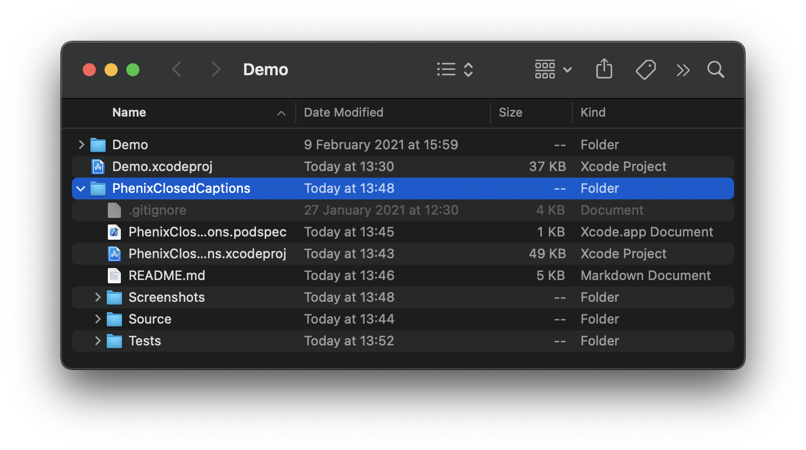
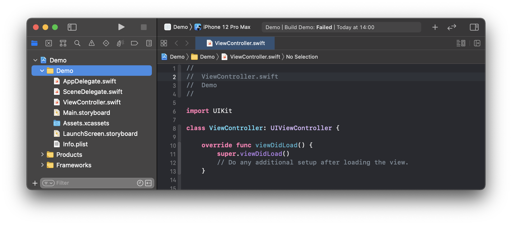
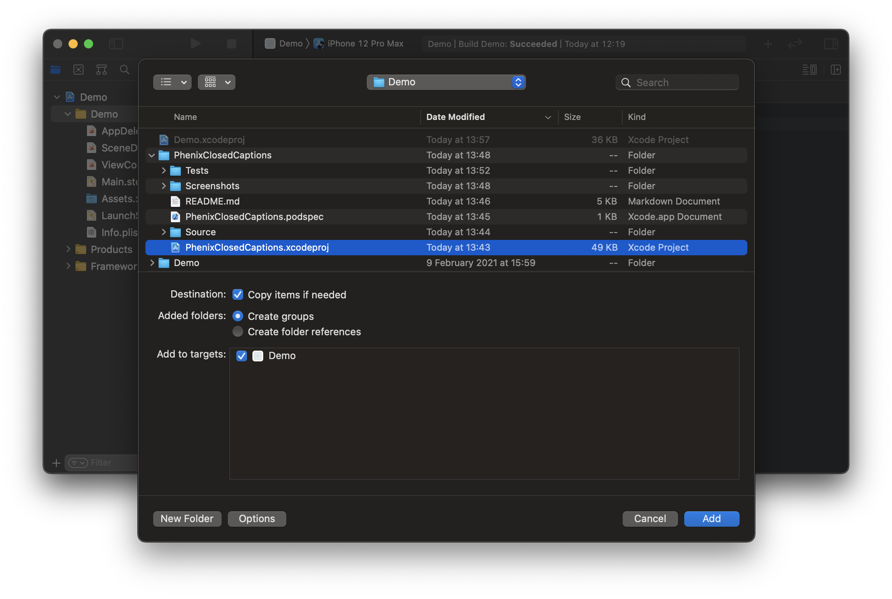
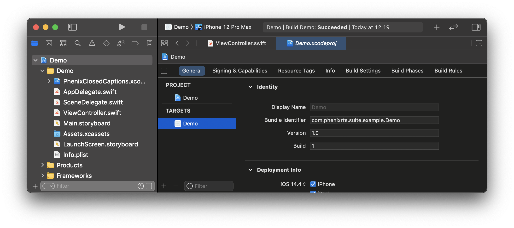
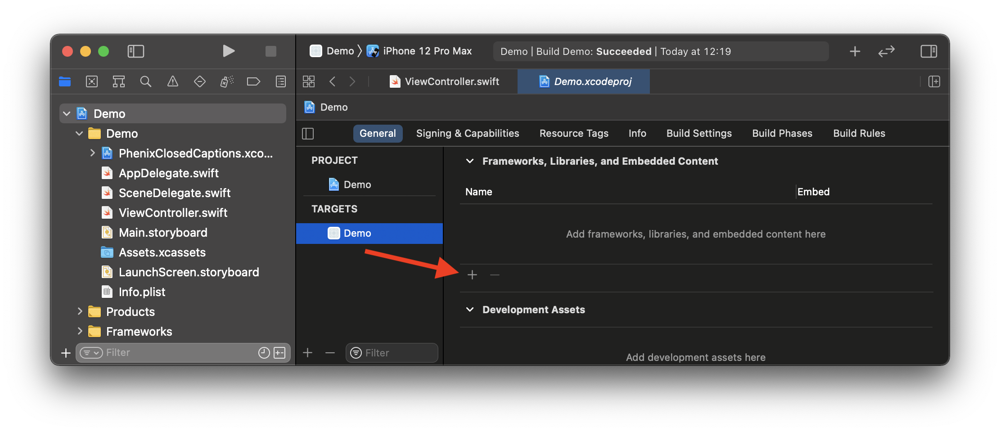
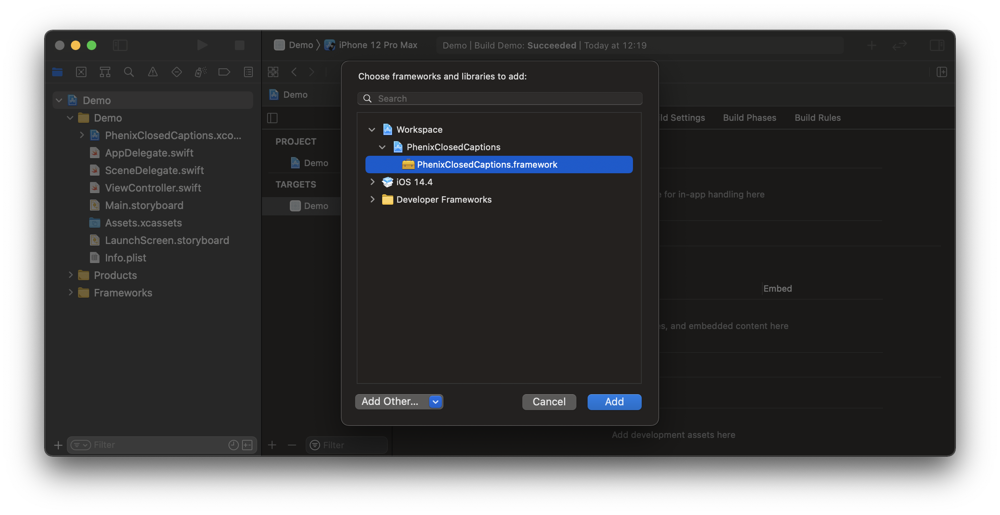

# Phenix Closed Captions

Support library providing Closed Captions integration using `PhenixSdk` under-the-hood.

## Requirements
* iOS 12.0+
* Xcode 11+
* Swift 5.1+

## Installation

### CocoaPods (using Development Pods)

[CocoaPods](https://cocoapods.org) is a dependency manager for Cocoa projects. For usage and installation instructions, visit their website.
To integrate `PhenixClosedCaptions` into your Xcode project using CocoaPods:

1. Move `PhenixClosedCaptions` root directory inside the ROOT directory of your iOS project.

2. Modify your `Podfile`:

```ruby
source 'https://cdn.cocoapods.org/'
source 'git@github.com:PhenixRTS/CocoaPodsSpecs.git' # Phenix private repository

target 'your app name'
  use_frameworks!
  pod 'PhenixClosedCaptions', :path => './PhenixClosedCaptions' # Closed Captions development pod
```

### Manually

If you prefer not to use [CocoaPods](https://cocoapods.org), you can integrate Phenix Closed Captions into your project manually.

1. Move `PhenixClosedCaptions` root directory to your project root directory.



2. Open your project in Xcode.

3. Select the root node of your project.



4. Select `Files - Add Files to “{your project name}”...` from the Mac status bar (while Xcode is focused).

5. In the file chooser, navigate to the `PhenixClosedCaptions` and select `PhenixClosedCaptions.xcodeproj`. Then click *Add* to add it as a sub-project.



6. Select the top level node of your project to open the project editor, click the main app target and then go to the General tab.



7. Scroll down to the `Frameworks, Libraries and Embedded Content` section.

8. Click on the + button to select and add a new framework or library.



9. Search for the `PhenixClosedCaptions.framework`, select it and click *Add* to embed into your project.



10. Make sure that the `PhenixSdk` is also embedded into your project and `PhenixClosedCaptions` can access it.

## Usage

### Simple usage

1. Import `PhenixClosedCaptions` framework in the file in which you want to use it:

```swift
import PhenixClosedCaptions
```

2. Create a `PhenixClosedCaptionsService` instance by providing to it `PhenixRoomService` instance. 
Remember to keep a strong reference of the `PhenixClosedCaptionsService` instance:

```swift
let roomService: PhenixRoomService = ...  // previously obtained
let closedCaptionsService = PhenixClosedCaptionsService(roomService: roomService)
```

3. Create a `PhenixClosedCaptionsView` instance. 
It will contain and display all the received Closed Captions in it. Add this view to the view hierarchy and pass it to the `PhenixClosedCaptionsService` instance:

```swift
let closedCaptionsView = PhenixClosedCaptionsView()
view.addSubview(closedCaptionsView)

// Set “closedCaptionsView” size.

closedCaptionsService.setContainerView(closedCaptionsView)
```

### Advanced usage

If you want to provide a custom functionality for each received Closed Captions message, you can conform to the `PhenixClosedCaptionsServiceDelegate` protocol.

1. Adopt the `PhenixClosedCaptionsServiceDelegate` protocol:

```swift
extension ViewController: PhenixClosedCaptionsServiceDelegate {
    // ...
}
```

2. Set the delegate for the `PhenixClosedCaptionsService` instance to receive the `PhenixClosedCaptionsServiceDelegate` updates:

```swift
closedCaptionsService.delegate = self
```

3. Implement required methods and provide your own logic, for example:

```swift
extension ViewController: PhenixClosedCaptionsServiceDelegate {
    func closedCaptionsService(
        _ service: PhenixClosedCaptionsService, 
        didReceive message: PhenixClosedCaptionsMessage) {
        // This is an example code.
        DispatchQueue.main.async { [weak self] in
            self?.label.text = message.textUpdates.first?.caption
        }
    }
}
```

If you do not want to rely on the provided _out-of-the-box_ user interface for the Closed Captions, you can disable automatic user interface updates by setting the `PhenixClosedCaptionsService` instance container view to `nil`:

```swift
closedCaptionsService.setContainerView(nil)
```

If you want to dynamically switch the Closed Captions service on/off, you can do that by changing the `PhenixClosedCaptionsService.isEnabled` parameter:

```swift
closedCaptionsService.isEnabled = true
```

## Customization

It is possible to provide your own user interface properties to customize the default look of the Closed Captions in multiple ways:

* Change the provided configuration properties on `PhenixClosedCaptionsView` instance:

```swift
closedCaptionsView.configuration.anchorPointOnTextWindow = CGPoint(x: 0.0, y: 0.0)
closedCaptionsView.configuration.positionOfTextWindow = CGPoint(x: 1.0, y: 1.0)
closedCaptionsView.configuration.widthInCharacters = 32
closedCaptionsView.configuration.heightInTextLines = 1
closedCaptionsView.configuration.textBackgroundColor = UIColor.black
...
```

* Provide your own customized property configuration by creating a `PhenixClosedCaptionsConfiguration` instance and setting required properties to it. Then provide this configuration to the `PhenixClosedCaptionsView` instance:

```swift
let customConfiguration = PhenixClosedCaptionsConfiguration(...)
closedCaptionsView.configuration = customConfiguration
```

3. Modify few parameters of the `PhenixClosedCaptionsConfiguration.default` configuration and provide that to the `PhenixClosedCaptionsView` instance:

```swift
let modifiedConfiguration = PhenixClosedCaptionsConfiguration.default
modifiedConfiguration.textBackgroundAlpha = 0.5
closedCaptionsView.configuration = modifiedConfiguration
```