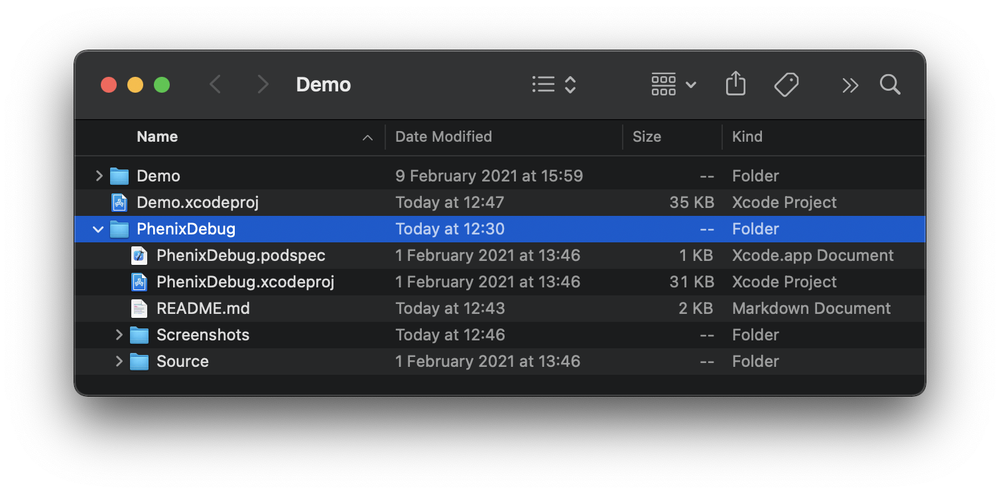
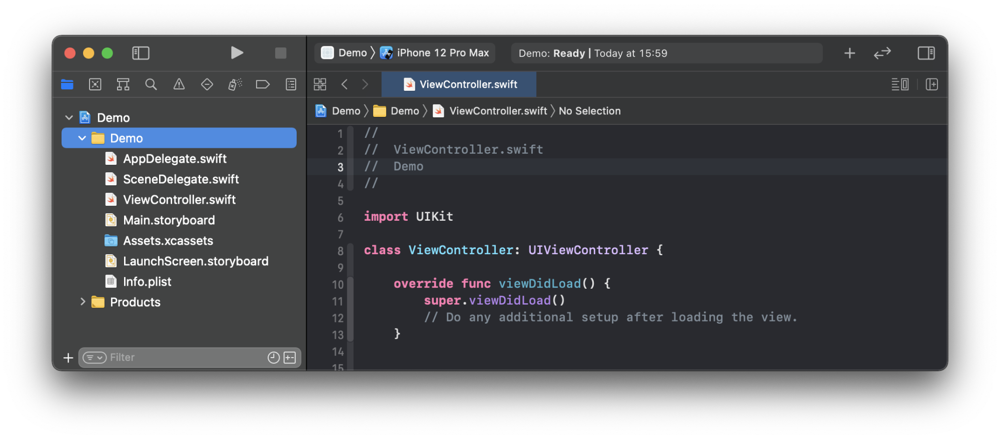
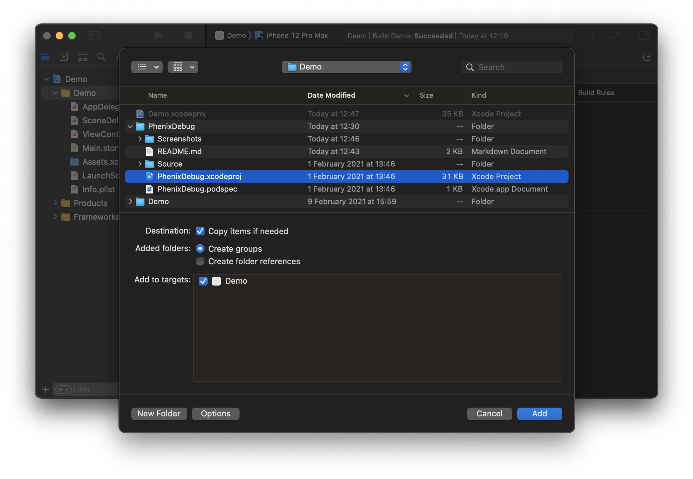
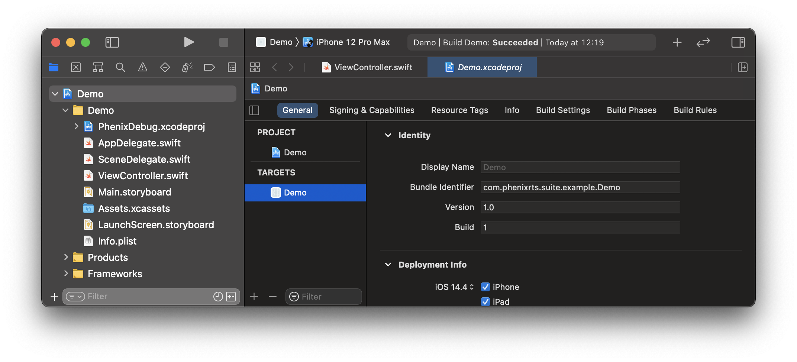
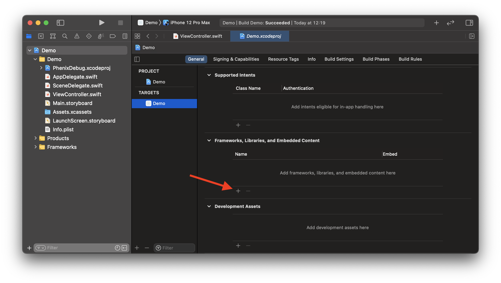
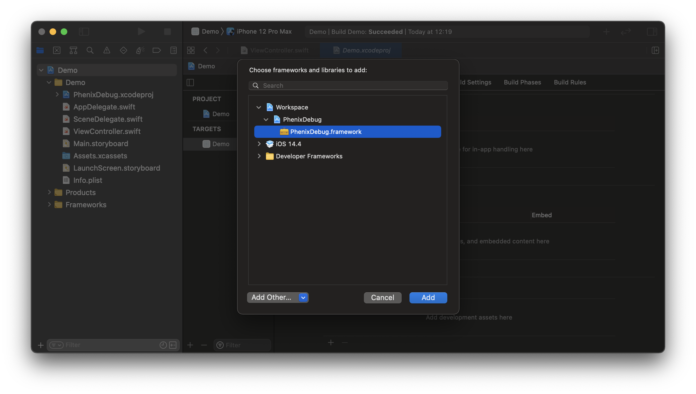

# Phenix Debug

Support framework providing necessary functionality to show debug view which displays the app and the `PhenixSdk` versions and shares run-time logs from the SDK.

## Requirements
* iOS 12.0+
* Xcode 11+
* Swift 5.1+

## Installation

### CocoaPods (using Development Pods)

[CocoaPods](https://cocoapods.org) is a dependency manager for Cocoa projects. For usage and installation instructions, visit their website.
To integrate `PhenixDebug` into your Xcode project using CocoaPods:

1. Move `PhenixDebug` root directory inside the ROOT directory of your iOS project.

2. Modify your `Podfile`:

```ruby
source 'https://cdn.cocoapods.org/'
source 'git@github.com:PhenixRTS/CocoaPodsSpecs.git' # Phenix private repository

target 'your app name'
  use_frameworks!
  pod 'PhenixDebug', :path => './PhenixDebug' # PhenixDebug development pod
```

### Manually

If you prefer not to use [CocoaPods](https://cocoapods.org), you can integrate Phenix Deeplink into your project manually.

1. Move `PhenixDebug` root directory to your project root directory.



2. Open your project in Xcode.

3. Select the root node of your project.



4. Select `Files - Add Files to “{your project name}”...` from the Mac status bar (while Xcode is focused).

5. In the file chooser, navigate to the `PhenixDebug` and select `PhenixDebug.xcodeproj`. Then click *Add* to add it as a sub-project.



6. Select the top level node of your project to open the project editor, click the main app target and then go to the General tab.



7. Scroll down to the `Frameworks, Libraries and Embedded Content` section.

8. Click on the + button to select and add a new framework or library.



9. Search for the `PhenixDebug.framework`, select it and click *Add* to embed into your project.



10. Make sure that the `PhenixSdk` is also embedded into your project and `PhenixDebug` can access it.

## Usage

You can display the `PhenixDebug` provided `PhenixDebugViewController(roomExpress:)` in any place and in any way you like.
Only remember, that it you will need to provide a `PhenixRoomExpress` instance to it.

### Example

1. In the view controller `viewDidLoad()` method, add a tap gesture to the view:

```swift
import PhenixDebug
import PhenixSdk
import UIKit

class ViewController: UIViewController {
    @IBOutlet private var surfaceView: UIView!

    override func viewDidLoad() {
        ...

        // Configure tap gesture to open debug menu, when user taps 5 times on the video surface view.
        let tapGesture = UITapGestureRecognizer(target: self, action: #selector(surfaceViewTappedMultipleTimes))
        tapGesture.numberOfTapsRequired = 5
        surfaceView.addGestureRecognizer(tapGesture)
    }

    ...
}
```

2. Create a method for showing the `PhenixDebugViewController` in the same view controller where you added the tap gesture:

```swift
import PhenixDebug
import PhenixSdk
import UIKit

class ViewController: UIViewController {
    ...

    @objc func surfaceViewTappedMultipleTimes() {
        let pcast: PhenixPCast = ...  // previously obtained
        let viewModel = PhenixDebugViewModel(pcast: pcast)
        let vc = PhenixDebugViewController(viewModel: viewModel)
        present(vc, animated: true)
    }
}
```
