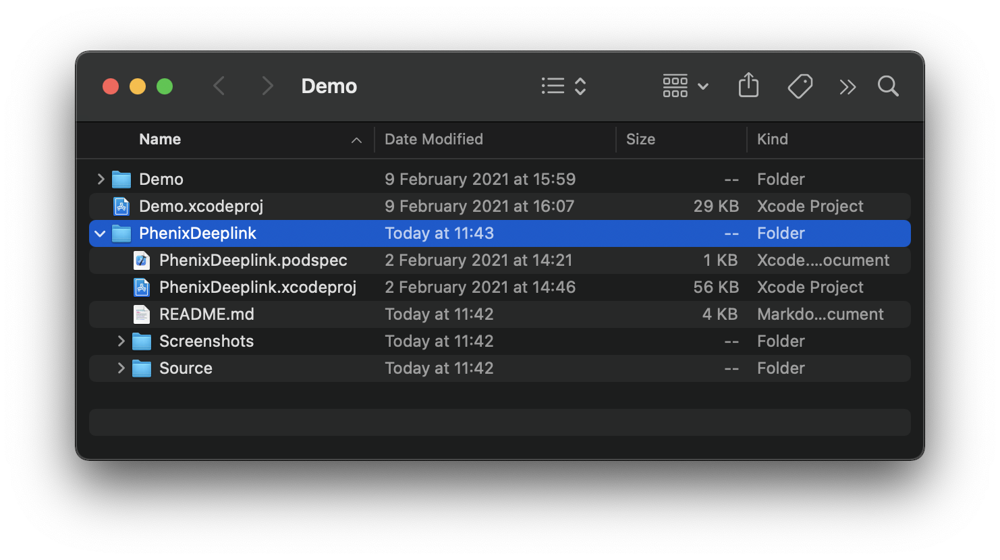
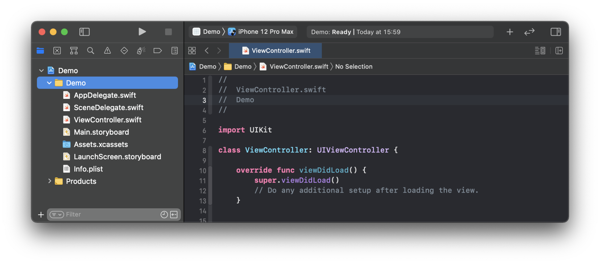
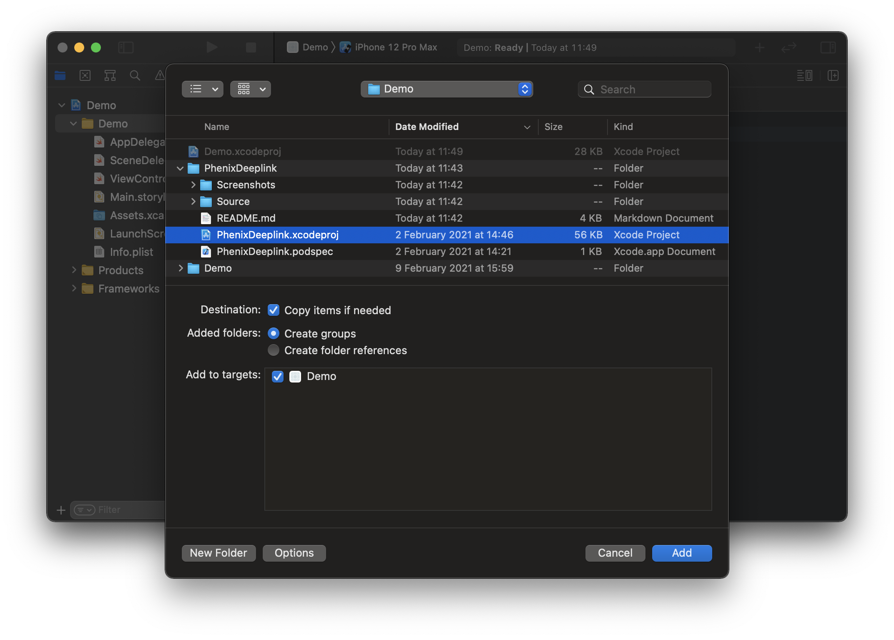
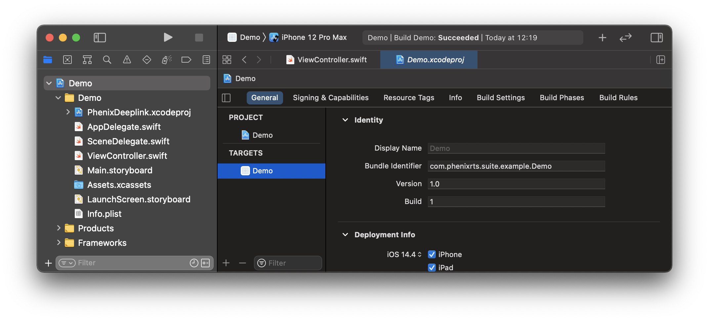
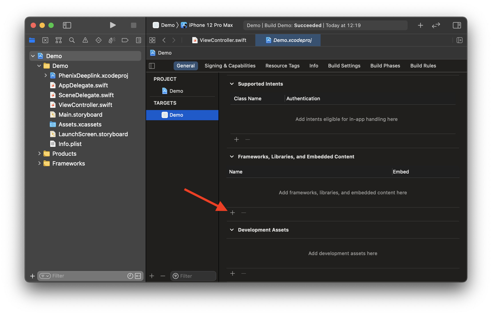
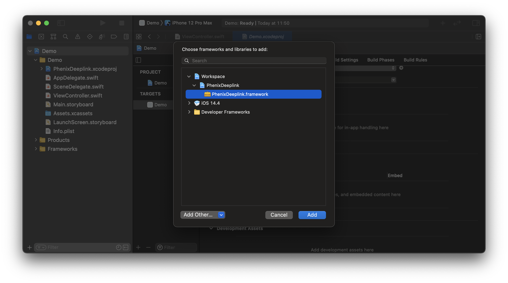

# Phenix Deeplink

Support framework providing necessary functionality to parse deep links.

## Requirements
* iOS 12.0+
* Xcode 11+
* Swift 5.1+

## Installation

### CocoaPods (using Development Pods)

[CocoaPods](https://cocoapods.org) is a dependency manager for Cocoa projects. For usage and installation instructions, visit their website.
To integrate `PhenixDeeplink` into your Xcode project using CocoaPods:

1. Move `PhenixDeeplink` root directory inside the ROOT directory of your iOS project.

2. Modify your `Podfile`:

```ruby
source 'https://cdn.cocoapods.org/'
source 'git@github.com:PhenixRTS/CocoaPodsSpecs.git' # Phenix private repository

target 'your app name'
  use_frameworks!
  pod 'PhenixDeeplink', :path => './PhenixDeeplink' # PhenixDeeplink development pod
```

### Manually

If you prefer not to use [CocoaPods](https://cocoapods.org), you can integrate Phenix Deeplink into your project manually.

1. Move `PhenixDeeplink` root directory to your project root directory.



2. Open your project in Xcode.

3. Select the root node of your project.



4. Select `Files - Add Files to “{your project name}”...` from the Mac status bar (while Xcode is focused).

5. In the file chooser, navigate to the `PhenixDeeplink` and select `PhenixDeeplink.xcodeproj`. Then click *Add* to add it as a sub-project.



6. Select the top level node of your project to open the project editor, click the main app target and then go to the General tab.



7. Scroll down to the `Frameworks, Libraries and Embedded Content` section.

8. Click on the + button to select and add a new framework or library.



9. Search for the `PhenixDeeplink.framework`, select it and click *Add* to embed into your project.



10. Make sure that the `PhenixSdk` is also embedded into your project and `PhenixDeeplink` can access it.

## Usage

1. Create a new deep link model, which will know how to parse the provided URL parameters. This model must conform to the `PhenixDeeplinkModelProvider` protocol.

Here is an example deep link model for URL like  `https://{host}?uri=https://pcast.phenixrts.com&backend=https://demo.phenixrts.com/pcast#test`:

```swift
import PhenixDeeplink

struct ExampleDeeplinkModel: PhenixDeeplinkModelProvider {
    let alias: String?
    let uri: URL?
    let backend: URL?

    init?(components: URLComponents) {
        self.alias = components.fragment

        if let string = components.queryItems?.first(where: { $0.name == "uri" })?.value {
            self.uri = URL(string: string)
        }

        if let string = components.queryItems?.first(where: { $0.name == "backend" })?.value {
            self.backend = URL(string: string)
        }
    }
}
```

2. In the *AppDelegate.swift* import the `PhenixDeeplink` framework

```swift
import PhenixDeeplink
```

3. In the *AppDelegate.swift* inside the method `func application(_:continue:restorationHandler:) -> Bool` make a deep link instance:

```swift
func application(_ application: UIApplication, continue userActivity: NSUserActivity, restorationHandler: @escaping ([UIUserActivityRestoring]?) -> Void) -> Bool {
    guard let deeplink = PhenixDeeplinkService<PhenixDeeplinkModel>.makeDeeplink(userActivity) else {
        return false
    }

    ...
}
```
